# Operator Guide / Guide de l'opérateur — StatCan Tables & Charts Validator

**EN / FR — both languages in one file. / Les deux langues dans un seul fichier.**

**Who this is for / Pour qui :** clerks and reviewers who use the application daily — no technical background assumed. / Commis et personnes réviseuses qui utilisent l'application au quotidien — aucune connaissance technique requise.

**Install first:** see `DEPLOYMENT_GUIDE.md`. **Problems or ideas:** see `FEEDBACK.md`.
**Installation d'abord :** voir `DEPLOYMENT_GUIDE.md`. **Problèmes ou idées :** voir `FEEDBACK.md`.

---

# ENGLISH

## 1. What the application does

The validator checks Excel workbooks (`.xlsx`) against Statistics Canada's **Tables 101** and **Charts 101** formatting guides and lists every deviation as a *finding*. For each finding it offers a **deterministic correction** — a precise, pre-defined change that you review and approve. Every accepted change produces a **new immutable iteration** of the workbook; nothing is ever overwritten.

Key properties, worth knowing when talking to clients:

- **Fully deterministic.** The same workbook always produces the same findings, on every machine. There is no AI, no randomness, and no internet connection involved in validation.
- **Bilingual.** The entire interface, every finding description, and the audit reports exist in English and French.
- **Audited.** Projects, revisions, decisions (who approved what, when, and why) are recorded and available in downloadable Markdown reports.

## 2. Starting the application

```bash
cd statcan-tablechart-validator
.venv/bin/streamlit run app/main.py --server.port 8502
```

Open `http://localhost:8502`. Pick the interface language in the sidebar (**Language / Langue**: `en` or `fr`).

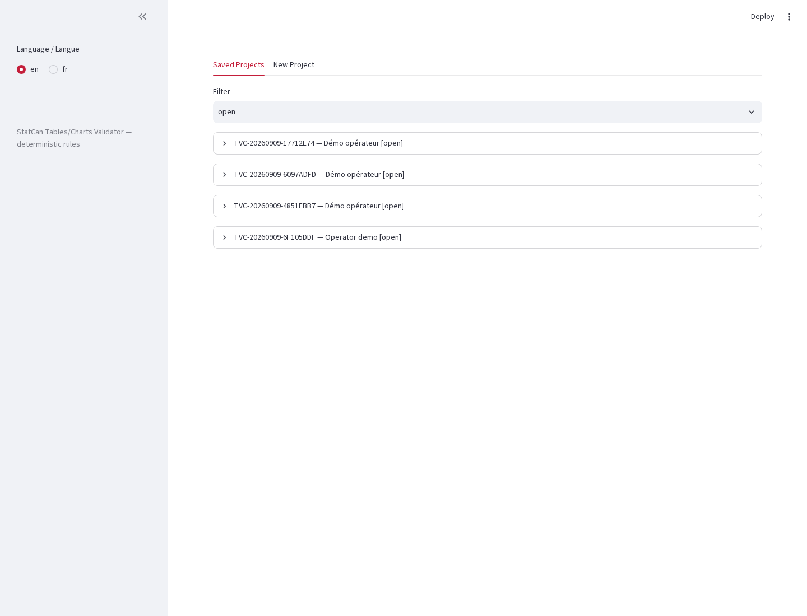

## 3. Creating a project

A project holds one submission and its full history.

1. Open the **New Project** tab.
2. Enter a **project label** (e.g. `Retail Daily — September`) and your **reviewer name**.
3. Click **Create project**. The project opens immediately and is listed under **Saved Projects** from now on.

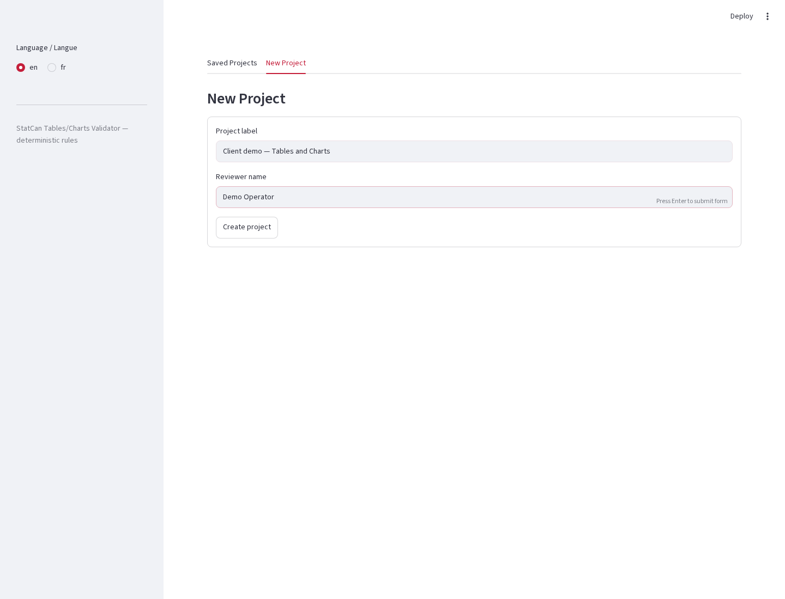

## 4. Validating a workbook

1. In your open project, click **Browse files** (the upload box) and choose an `.xlsx` workbook.
2. Select the **language of the workbook** (`en` or `fr`) — this controls which language the report texts assume.
3. If this is a **replacement** (a new version of a workbook already in the project), pick the **reason** (Corrected data, Revised content, Formatting change, Language revision, Other) and write the **required note** describing what changed.
4. Click **Validate**.

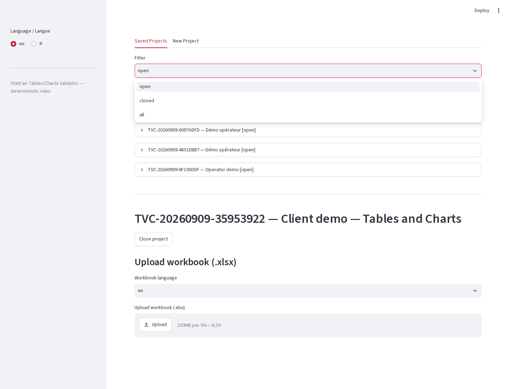

The status panel always shows the current state of the active workbook: **Revision** number, **Compliance** (Compliant / Not compliant), **Open findings**, and **Resolved by iteration**.

## 5. Reading the findings list

Each line shows severity (`[ERROR]` = must fix, `[WARNING]` = should fix, `[INFO]` = optional), the rule ID (e.g. `T101-NO-EMPTY-CELLS`), its description, and the sheet/location. Click the arrow on the right to expand a finding: you get the full bilingual description, the exact cell locations, and — where the rule allows it — **deterministic resolution options**.


Finding IDs prefixed `T101-` come from Tables 101; `C101-` from Charts 101. A workbook with **zero findings** shows the green compliance panel:

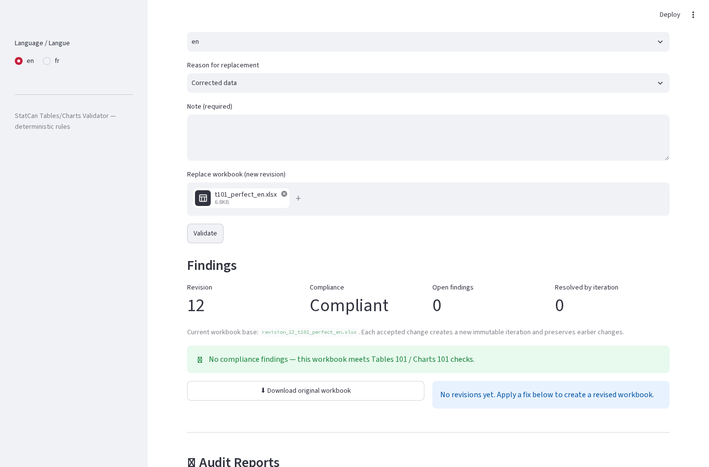

## 6. Applying a deterministic correction

1. Expand a finding that offers resolution options (e.g. `T101-NO-EMPTY-CELLS` — choose the standard symbol to place, or enter a value).
2. Review the proposed change — it is stated exactly (sheet, cell, new content). Nothing is hidden.
3. Click **Apply**. The app creates a **new immutable iteration** file, records your approval (who/when/why), and re-validates automatically: the status panel updates, the fixed finding disappears from the open list, and the workbook downloads are refreshed.

Every iteration is kept. Use the two side-by-side download buttons (**Download original workbook** / **Download revised workbook**) at any time. Some rules (mostly chart geometry like series counts and sizes) are **detect-only**: the app flags them, but the fix must be done in Excel by hand — the finding says so explicitly.

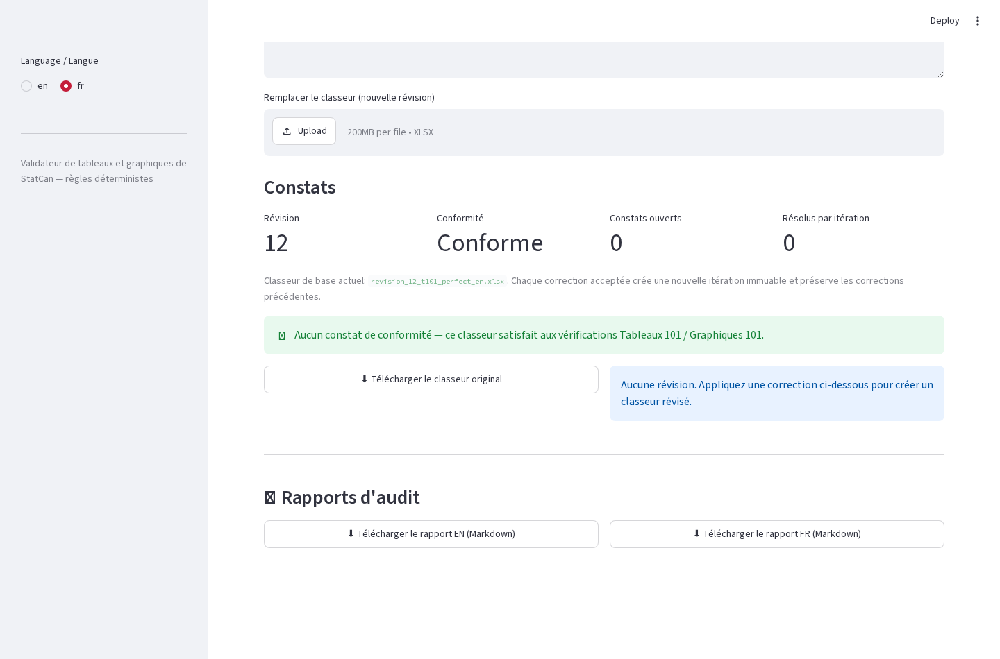

## 7. Downloading audit reports

At the bottom of the project page, **Rapports d'audit / Audit Reports** gives the two Markdown reports (EN and FR): submission metadata, every finding, every decision with reviewer, reason and note, and the iteration lineage. These are the deliverables for an audit trail.

## 8. Recording decisions without applying a fix

You can also mark a finding **resolved-by-decision** (e.g. "suppressed cell approved by domain unit"): expand the finding, choose **Record decision**, and fill the reason + note. Decisions appear in the audit report exactly like applied fixes.

## 9. Daily habits that keep the audit clean

- **One submission = one project.** Replacements go into the same project as new revisions, with a written reason.
- **Write meaningful notes.** The note is part of the permanent record.
- **Validate after every fix** — the app does it automatically; don't skip reading the result.
- **Download the EN and FR reports before closing** a submission.

---

# FRANÇAIS

## 1. Ce que fait l'application

Le validateur vérifie les classeurs Excel (`.xlsx`) selon les guides de mise en forme **Tableaux 101** et **Graphiques 101** de Statistique Canada et liste chaque écart sous forme de *constat*. Pour chaque constat, il propose une **correction déterministe** — un changement précis et prédéfini que vous examinez et approuvez. Chaque changement accepté produit une **nouvelle itération immuable** du classeur ; rien n'est jamais écrasé.

Propriétés essentielles, utiles devant un client :

- **Totalement déterministe.** Le même classeur produit toujours les mêmes constats, sur n'importe quel poste. Aucune IA, aucun aléa, aucune connexion Internet dans la validation.
- **Bilingue.** Toute l'interface, chaque description de constat et les rapports d'audit existent en anglais et en français.
- **Audité.** Les projets, révisions et décisions (qui a approuvé quoi, quand, pourquoi) sont consignés et disponibles dans des rapports Markdown téléchargeables.

## 2. Démarrage de l'application

```bash
cd statcan-tablechart-validator
.venv/bin/streamlit run app/main.py --server.port 8502
```

Ouvrez `http://localhost:8502`. Choisissez la langue de l'interface dans la barre latérale (**Language / Langue** : `en` ou `fr`).

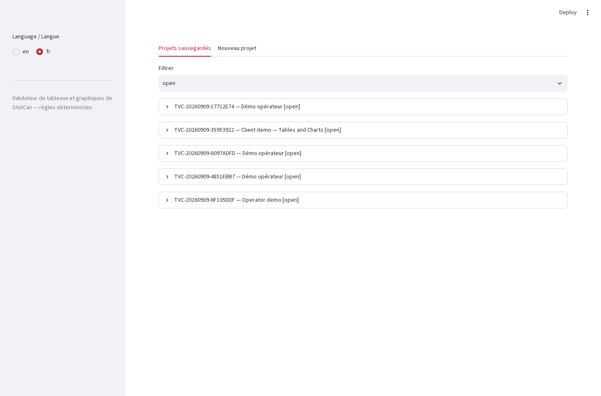

## 3. Création d'un projet

Un projet contient une soumission et tout son historique.

1. Ouvrez l'onglet **Nouveau projet**.
2. Saisissez l'**étiquette du projet** (p. ex. `Commerce de détail quotidien — septembre`) et votre **nom de réviseur**.
3. Cliquez sur **Créer le projet**. Le projet s'ouvre aussitôt et apparaît désormais sous **Projets sauvegardés**.

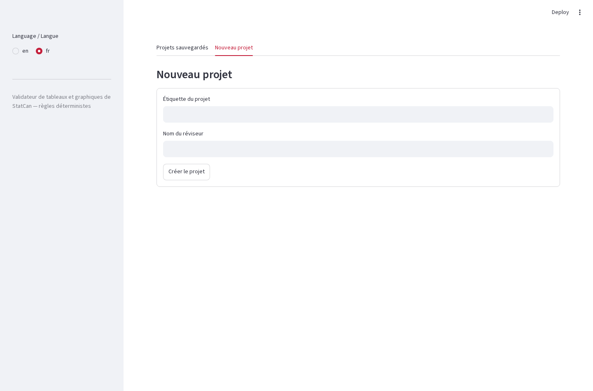

## 4. Validation d'un classeur

1. Dans le projet ouvert, cliquez sur **Parcourir les fichiers** (la zone de téléversement) et choisissez un classeur `.xlsx`.
2. Sélectionnez la **langue du classeur** (`en` ou `fr`) — elle détermine la langue des textes du rapport.
3. S'il s'agit d'un **remplacement** (nouvelle version d'un classeur déjà dans le projet), choisissez le **motif** (Données corrigées, Contenu révisé, Changement de mise en forme, Révision linguistique, Autre) et rédigez la **note obligatoire** décrivant le changement.
4. Cliquez sur **Valider**.

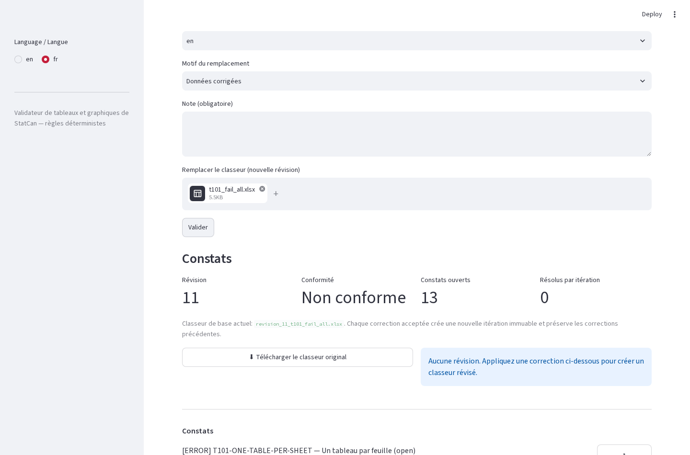

Le panneau d'état affiche toujours l'état du classeur actif : numéro de **révision**, **conformité** (Conforme / Non conforme), **constats ouverts** et **résolus par itération**.

## 5. Lecture de la liste des constats

Chaque ligne indique la gravité (`[ERROR]` = à corriger, `[WARNING]` = à considérer, `[INFO]` = facultatif), l'identifiant de la règle (p. ex. `T101-NO-EMPTY-CELLS`), sa description, et la feuille/l'emplacement. Cliquez sur la flèche à droite pour déplier : description bilingue complète, cellules exactes et — lorsque la règle le permet — **options de résolution déterministes**.

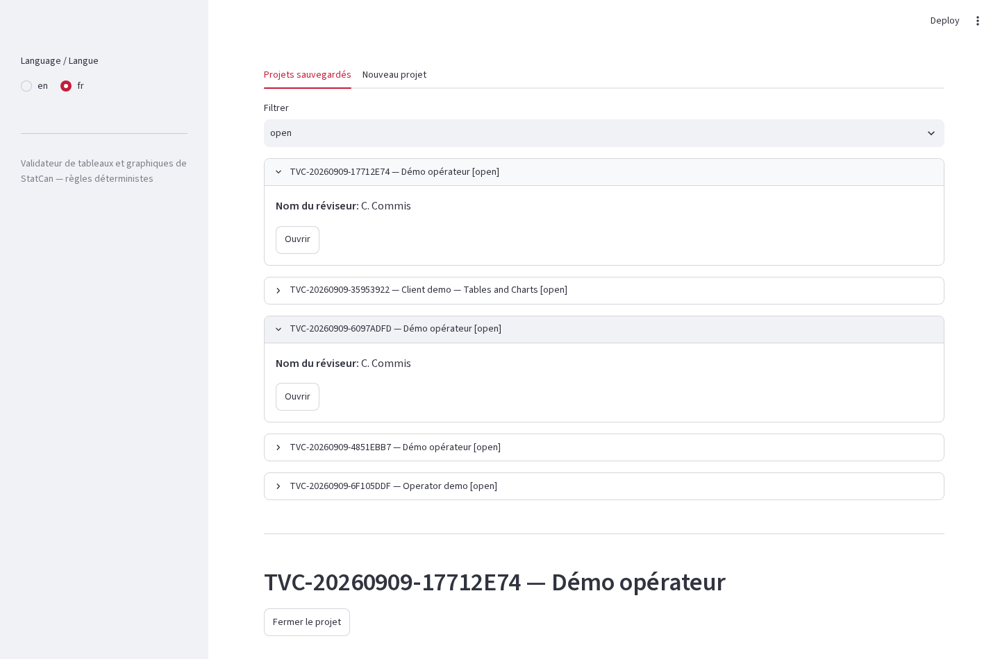

Les identifiants préfixés `T101-` proviennent de Tableaux 101 ; `C101-` de Graphiques 101. Un classeur **sans aucun constat** affiche le panneau vert de conformité (voir la capture de la section 4 en anglais pour la disposition).

## 6. Application d'une correction déterministe

1. Dépliez un constat offrant des options de résolution (p. ex. `T101-NO-EMPTY-CELLS` — choisissez le symbole normalisé à insérer, ou saisissez une valeur).
2. Examinez le changement proposé — il est énoncé exactement (feuille, cellule, nouveau contenu). Rien n'est caché.
3. Cliquez sur **Appliquer**. L'application crée un **nouveau fichier d'itération immuable**, consigne votre approbation (qui/quand/pourquoi) et revalide automatiquement : le panneau d'état se met à jour, le constat corrigé disparaît de la liste ouverte, et les téléchargements du classeur sont actualisés.

Chaque itération est conservée. Utilisez à tout moment les deux boutons de téléchargement côte à côte (**Télécharger le classeur original** / **Télécharger le classeur révisé**). Certaines règles (surtout la géométrie des graphiques : nombre de séries, dimensions) sont **en détection seule** : l'application les signale, mais la correction doit être faite à la main dans Excel — le constat l'indique explicitement.


## 7. Téléchargement des rapports d'audit

Au bas de la page du projet, **Rapports d'audit** fournit les deux rapports Markdown (EN et FR) : métadonnées de la soumission, tous les constats, toutes les décisions avec réviseur, motif et note, ainsi que la filiation des itérations. Ce sont les livrables de la piste d'audit.

## 8. Consigner une décision sans appliquer de correctif

Vous pouvez aussi marquer un constat **résolu par décision** (p. ex. « cellule supprimée approuvée par l'unité responsable ») : dépliez le constat, choisissez **Consigner la décision**, puis remplissez le motif et la note. Les décisions figurent dans le rapport d'audit exactement comme les correctifs appliqués.

## 9. Habitudes quotidiennes pour une piste d'audit propre

- **Une soumission = un projet.** Les remplacements entrent dans le même projet comme nouvelles révisions, avec un motif rédigé.
- **Rédigez des notes utiles.** La note fait partie du dossier permanent.
- **Validez après chaque correctif** — l'application le fait automatiquement ; lisez toujours le résultat.
- **Téléchargez les rapports EN et FR avant de fermer** une soumission.


---

## Appendix — Visual tour of the project workflow / Annexe — Tour visuel du flux de projet

Additional screenshots / Captures d'écran supplémentaires :

**Findings overview after validation (metrics, downloads, finding list) /
Vue d'ensemble des constats après validation :**

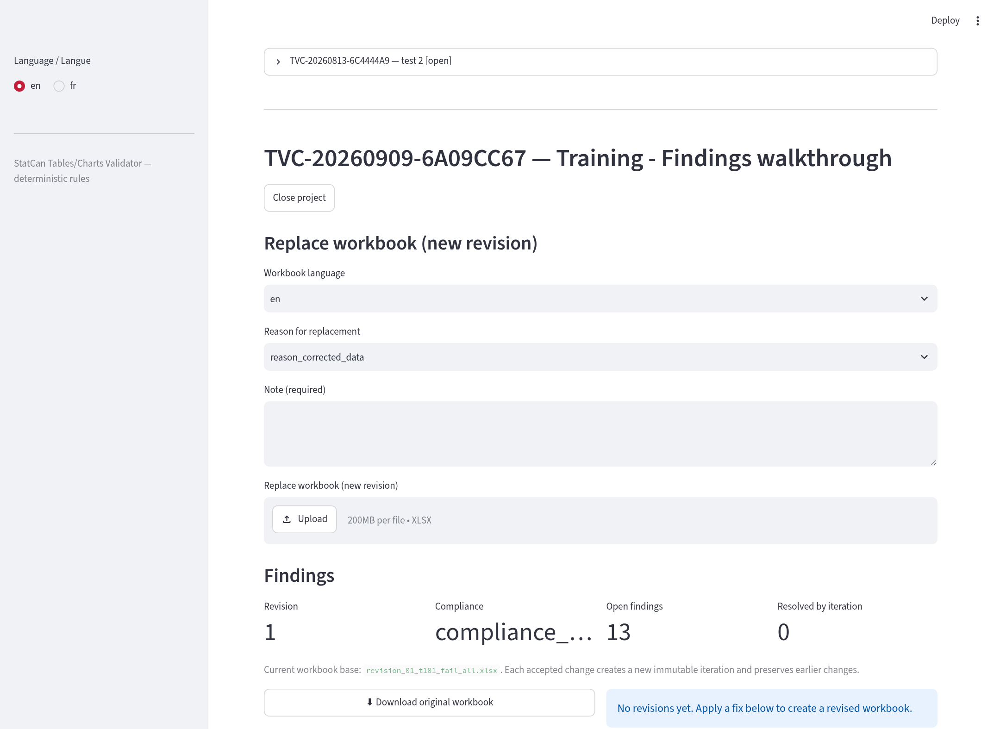

**Compliant project — zero findings, green panel / Projet conforme — zéro
constat, panneau vert :**

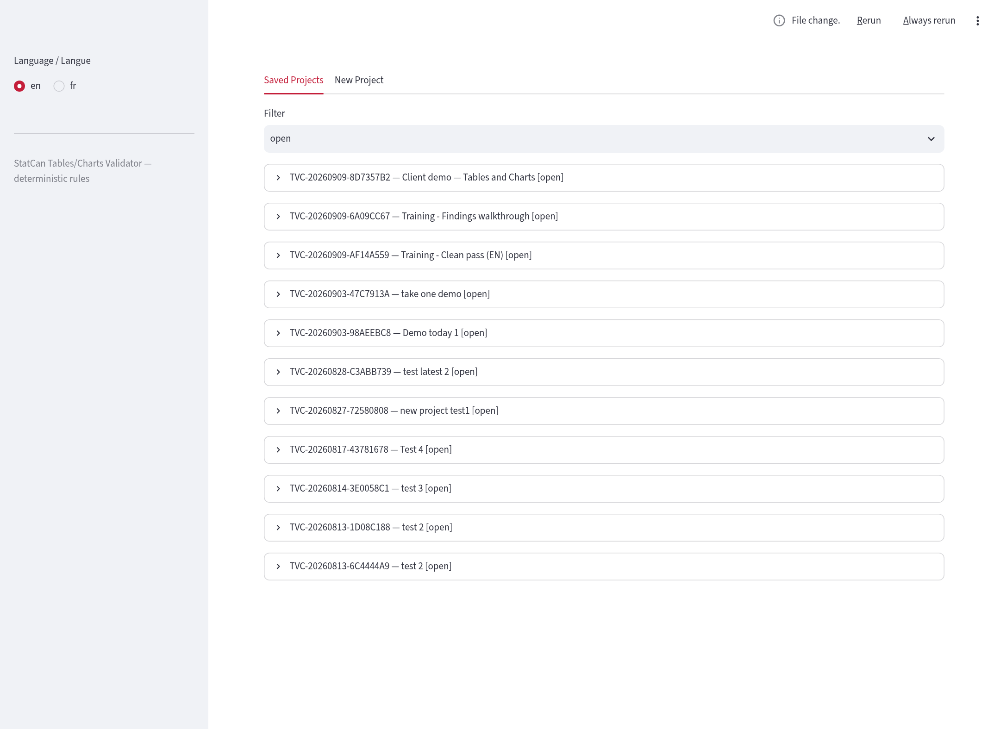

**French interface with a project open / Interface française avec un projet
ouvert :**

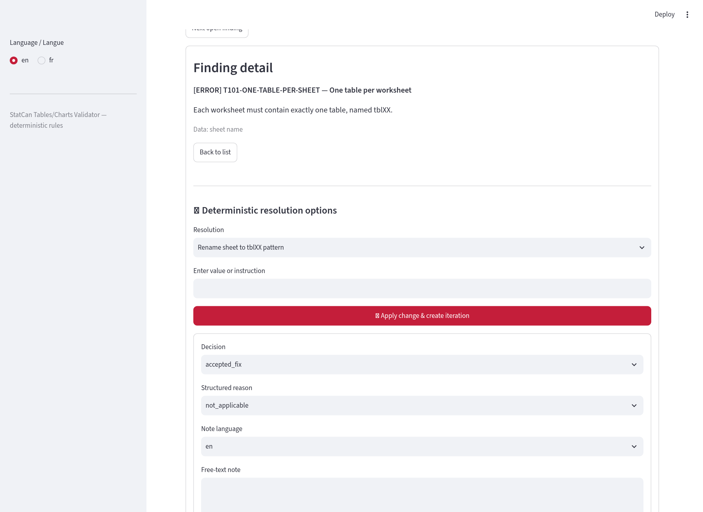
